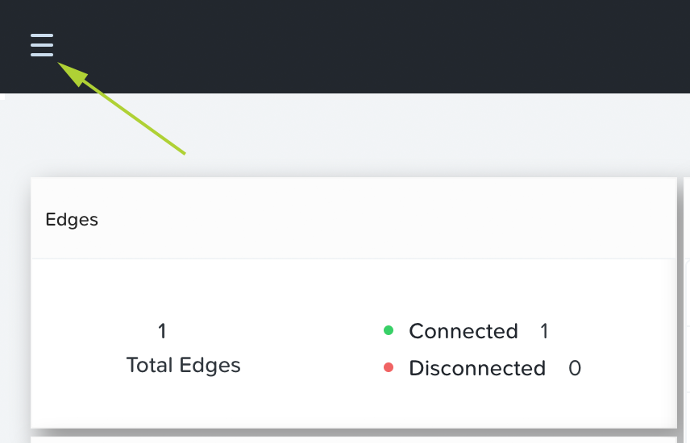
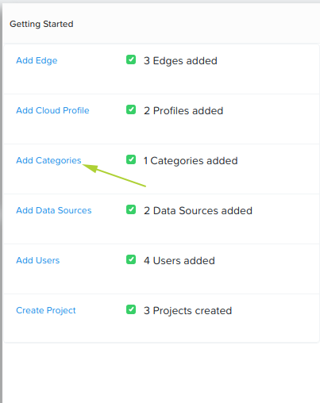
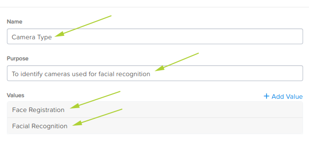

.. _category:

----------
Categories
----------

For our lab, a category will be used to tag your camera data source.  The data source will be added in the next step.

1. Login to the Nutanix Xi IoT Dashboard_ using the credentials that have been provided for you.
2a. Option 1: Using the "hamburger" button, expand the **Infrastructure** section and select **Categories**.

2b. Option 2: From the **Dashboard** page, click **Add Categories** inside the **Getting Started** group.

3. Enter a friendly name for the category.  The name should identify the location or provide information about the items that will belong to that category.  For our lab, please name your category **Camera Type**.
4. Click **Add Value** and enter **Facial Recognication**.
5. Click the check mark next to **Facial Recognition**.
6. Click **Create**.

**Additional note**: Categories help you assign various attributes to data sources which can be further used to query and select them when creating Data Pipelines. Example of a category could be “City” with values in [San Francisco, San Jose, San Diego] or “State” with values in [California, Washington, Oregon] and so on. It can be anything meaningful to your environment.

Adding the Nutanix Xi IoT Category is now complete.

.. _Dashboard: https://iot.nutanix.com/
