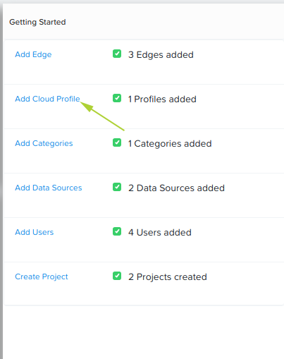

.. _cloud:

*************
Cloud Profile
*************

In this lab, adding a Cloud Profile allows us to use AWS, if required, to act as a destination or output for the results of a data pipeline.

1. Login to the Nutanix Xi IoT Dashboard_ using the credentials that have been provided for you.
2a. Option 1: Using the "hamburger" button, expand the **Infrastructure** section and select **Cloud Profiles**.

.. figure:: ../images/hamburger.png

2b. Option 2: From the **Dashboard** page, click **Add Cloud Profile** inside the **Getting Started** group.

3. Set the **Cloud Type** to **AWS**
4. For the Cloud Profile name, please enter **ecs-facefeed-demo**.
5. For the description, enter something meaningful e.g. **Cloud Profile connection for AWS**.
6. For the Access Key, enter the access key provided by your lab presenter.
7. For the Secret, enter the secret provided by your lab presenter.

**Note**: The AWS IAM credentials above have been provided specifically for this lab.

8. Click **Create**.

Adding the Nutanix Xi IoT Cloud Profile is now complete.

.. _Dashboard: https://iot.nutanix.com/
