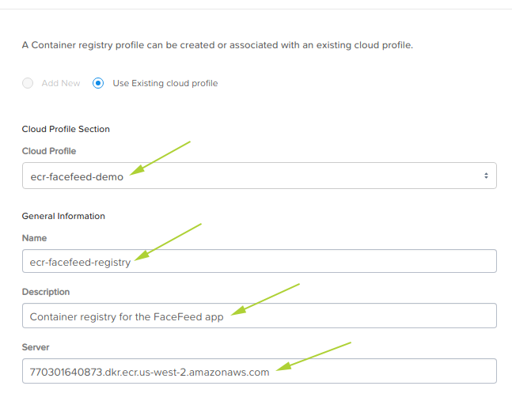

.. _registry:

**************************
Elastic Container Registry
**************************

Because we are going to deploy an application via Docker container, we must now create a connection to the Docker container registry hosting that application.

The Container Registry profile specifies the location of the registry as well as the credentials required to connect to it.  The container registry is typically hosted on a cloud provider service account of some description.

1. Login to the Nutanix Xi IoT Dashboard_ using the credentials that have been provided for you.
2. Using the "hamburger" button, expand the **Infrastructure** section and select **Container Registry Profiles**.

.. figure:: ../images/hamburger.png

3. Click **Create**.
4. Because we have already created a **Cloud Profile**, we can select **Use Existing cloud profile**.
5. From the dropdown list provided, select the **ecr-facefeed-demo** Cloud Profile created in the previous step.
6. Set the name of the Container Registry Profile to **ecr-facefeed-registry**.
7. For the desciption, enter something meaningful e.g. **Container registry for the FaceFeed app**.
8. Set the **Server** to **770301640873.dkr.ecr.us-west-2.amazonaws.com**.

9. Click **Create**.

Adding the Nutanix Xi IoT Container Registry is now complete.

.. _Dashboard: https://iot.nutanix.com/
