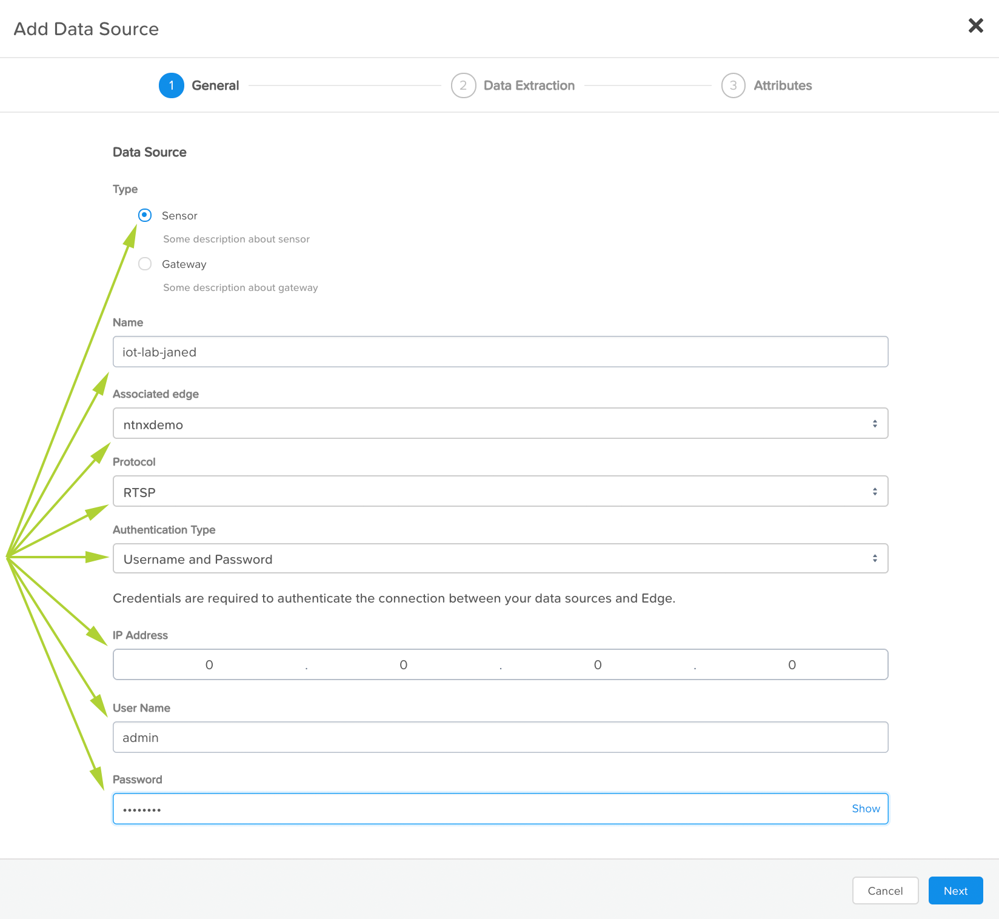
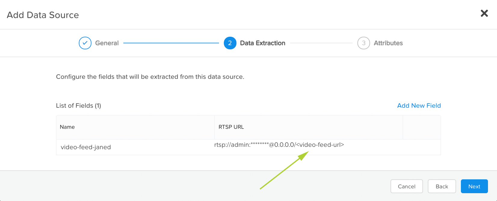
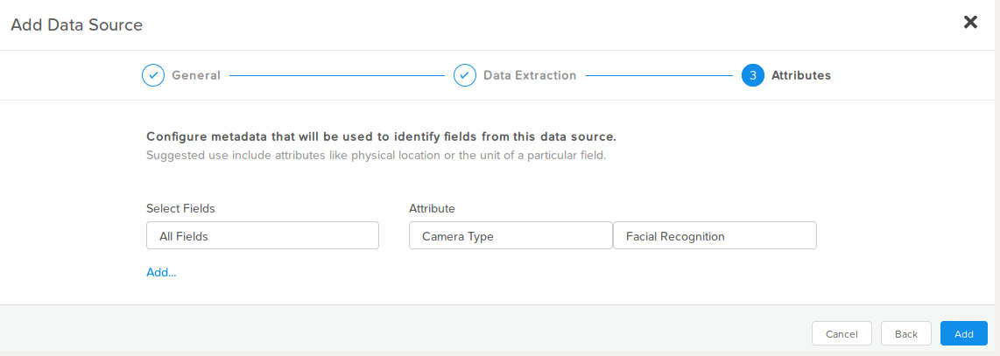

.. _datasource:

************
Data Sources
************

For the Nutanix Xi IoT lab to proceed, and now that your edge device is online, you can add your camera as a Data Source.

The data source is a critical component as it's the physical device providing the RTSP_ video feed that gets processed on the edge devices.

**Please refer to the camera IP address that has been provided to you.  Please use only your IP address!**

1. Login to the Nutanix Xi IoT Dashboard_ using the credentials that have been provided for you.
2a. Option 1: Using the "hamburger" button, expand the **Infrastructure** section and select **Data Sources**.

.. figure:: ../images/hamburger.png

2b. Option 2: From the **Dashboard** page, click **Add Data Sources** inside the **Getting Started** group.

.. figure:: ../images/getting_started.png

3. Set the Data Source type to **Sensor**.
4. Give your data source a meaningful name, e.g. **iot-lab-<your_initials>**.  For Jane Doe, you could use **iot-lab-janed**.
5. Select the associated edge device's name.  For this step, please only choose **your** edge device deployed in the previous step.
6. Select the protocol as **RTSP**.
7. Set the authentication type to **Username and Password**.
8. Enter the provided camera's IP address.
9. Enter the provided camera's username.
10. Enter the provided camera's password.

For example (your settings will be different):

11. Click **Next**.

Page 2 of the add data sources process is where we can specify device-specific settings.  For example, different camera vendors may have different URLs for the RTSP feed.

12. Click **Add New Field**.
13. Give the field a meaningful name, e.g. **video-feed-<your_initials>**.  For Jane Doe, you could use **video-feed-janed**.
14. In the field for **RTSP URL**, enter **<video-feed-url>**, click the blue check mark button and click **Next**.

**Note**: For this lab, please set **<video-feed-url>** to **/unicast**.

Page 3 is where we specify metadata that will identify this feed.

15. Set the **Attribute** to **Camera Type**.
16. Set the and the corresponding data type field to **Facial Recognition**.

17. Finally, click **Add**.

Adding the Nutanix Xi IoT Data Source is now complete.

.. _Dashboard: https://iot.nutanix.com/
.. _RTSP: https://en.wikipedia.org/wiki/Real_Time_Streaming_Protocol
