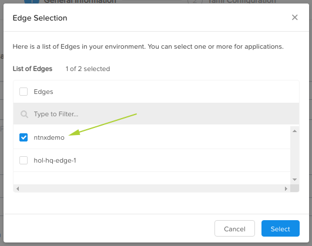
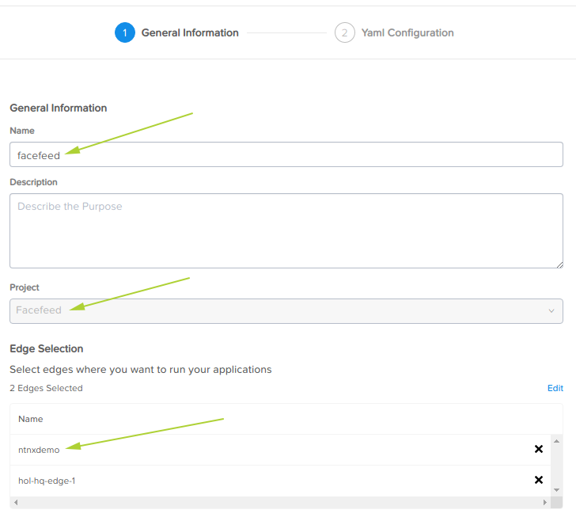
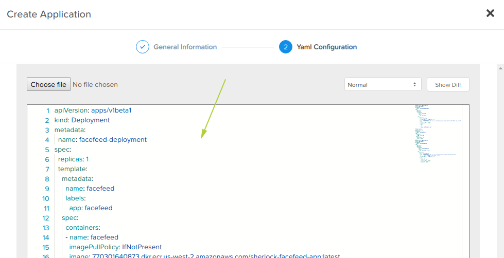

.. _app:

************
FaceFeed App
************

The final step in the lab to deploy the FaceFeed app itself.  This is done by deploying a pre-existing YAML specification prepared by the Nutanix Xi IoT team.

1. Login to the Nutanix Xi IoT Dashboard_ using the credentials that have been provided for you.
2. Using the "hamburger" button, expand the **Apps and Data** section and select **Applications**.

.. figure:: ../images/hamburger.png

3. Click **Create**.
4. Enter the name of the application as **Facefeed UI**.
5. Set the description of the FaceFeed application to something meaningful (even though it won't affect the application's operation).
6. From the **Project** dropdown list provided, select the **FaceFeed** Project you created earlier.
7. In the **Edge Selection** section, click the **Select Edges** button.
8. Place a check mark next to your edge device.

9. Click **Select**.

10. Click **Next**.
11. Obtain a copy of the FaceFeed app YAML from the following Github repository: FaceFeed_
12. Copy the YAML and paste it into the textarea provided.

13. Click **Create**.

Deploying the FaceFeed app is now complete.

.. _Dashboard: https://iot.nutanix.com/
.. _Functions: https://github.com/nutanix/xi-iot/tree/master/projects/facefeed/functions
.. _FaceFeed: https://raw.githubusercontent.com/nutanix/xi-iot/master/projects/facefeed/applications/facefeed.yaml
