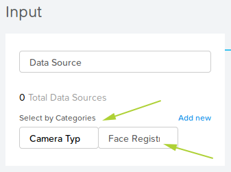
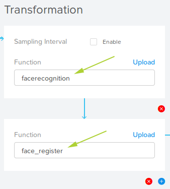
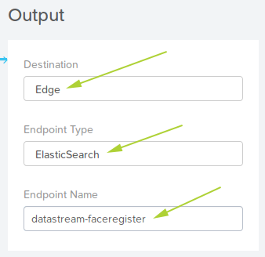
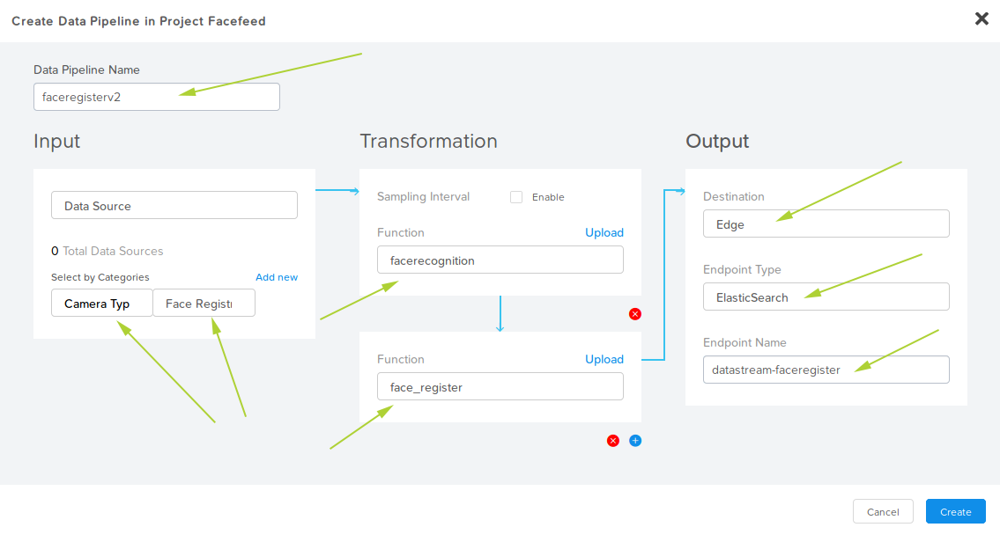
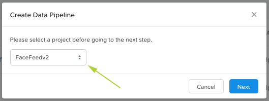
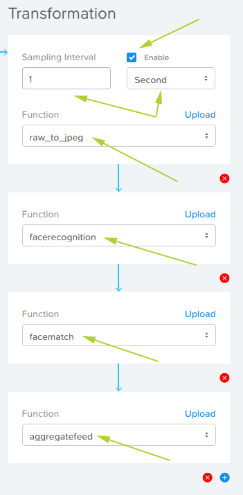
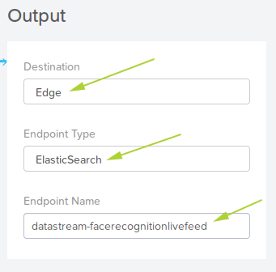

.. _app:

------------
FaceFeed App
------------

The final step in the lab to deploy the FaceFeed app itself.  This is done by deploying a pre-existing YAML specification prepared by the Nutanix Xi IoT team.

1. Login to the Nutanix Xi IoT Dashboard_ using the credentials that have been provided for you.
2. Using the "hamburger" button, expand the **Apps and Data** section and select **Applications**.

.. figure:: ../images/hamburger.png

3. Click **Create**.
4. Enter the name of the application as **facefeed**.
5. Set the description of the FaceFeed application to something meaningful (even though it won't affect the application's operation).
6. From the **Project** dropdown list provided, select the **FaceFeed** Project you created earlier.
7. In the **Edge Selection** section, click the **Select Edges** button.
8. Place a check mark next to your edge device.

9. Click **Select**.

10. Click **Next**.
11. 

6. Within the **Input** section, click **Add Data Source** and select **Data Source**.
7. From the Data Sources dropdown list, select the **Data Type** category created earlier.

10. 

8. Set the field to **Custom**.

9. Within the **Transformation** section, click **Add Function**.
10. From the dropdown list, select **facerecognition**.  Remember that these function names match the Tensorflow Python functions created earlier.
11. Click **Add Function** again.
12. From the dropdown list, select **face_register**.

13. Within the **Output** section, click **Add Destination**.
14. From the dropdown list, select **Edge**.
15. Enter the Name as **faceregister** (exactly as shown, *including case-sensititivity*).
16. Set the Endpoint Type to **ElasticSearch**.

The final **faceregister** Data Pipeline, when created correctly, will look as shown in the screenshot below.

Pipeline #2 - "facerecognitionlivefeed"
=======================================

Summary:

Data Pipeline 2: **facerecognitionlivefeed**
This data pipeline will source the pictures from RTSP camera data source we created earlier.
It will apply TensorFlow Machine Learning model to detect faces, calculate FaceIDs and lookup in the Elastic Search to find a match.
Application Container for Facefeed will show the Known vs Unknown faces depending upon inferencing.

1. Login to the Nutanix Xi IoT Dashboard_ using the credentials that have been provided for you.
2. Using the "hamburger" button, expand the **Apps and Data** section and select **Data Pipelines**.

.. figure:: ../images/hamburger.png

3. Click **Create**.
4. From the dropdown list provided, select the **FaceFeed** application created earlier.

5. Click **Next**.
6. Within the **Input** section, click **Add Data Source** and select **Data Source**.
7. From the Data Sources dropdown list, select the **Data Type** category created earlier.
8. Set the field to **Image**.

.. figure:: ../images/create_dp_select_input_image.png

9. Within the **Transformation** section, click **Add Function**.
10. From the dropdown list, select **raw_to_jpeg**.
11. Check the Enable box next to **Sampling Interval**.
12. Set the Sampling Interval to **1 Second**.
13. Click **Add Function** again.
14. From the dropdown list, select **facerecognition**.
15. Click **Add Function** again.
16. From the dropdown list, select **facematch**.
17. Click **Add Function** again.
18. From the dropdown list, select **aggregatefeed**.

19. Within the **Output** section, click **Add Destination**.
20. From the dropdown list, select **Edge**.
21. Enter the Name as **facerecognitionlivefeed** (exactly as shown, *including case-sensititivity*).
22. Set the Endpoint Type to **ElasticSearch**.

Note: Your associated edge device list will be different.

The final **facerecognitionlivefeed** Data Pipeline, when created correctly, will look as shown in the screenshot below.

.. figure:: ../images/create_dp_faceregister_final_2.png

Adding the Nutanix Xi IoT Data Pipelines is now complete.

.. _Dashboard: https://iot.nutanix.com/
.. _Functions: http://bit.ly/facefeed-functions
