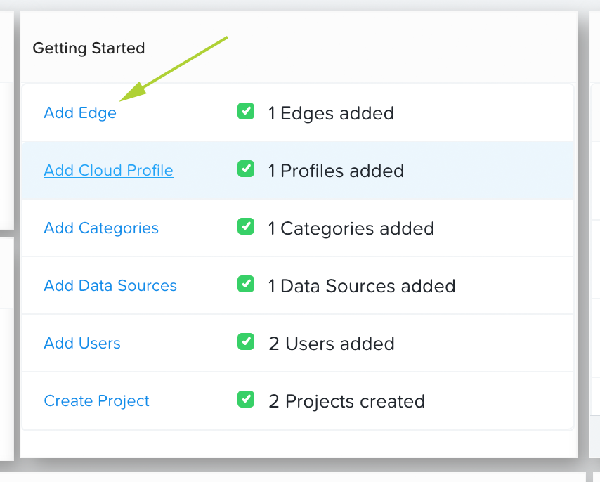
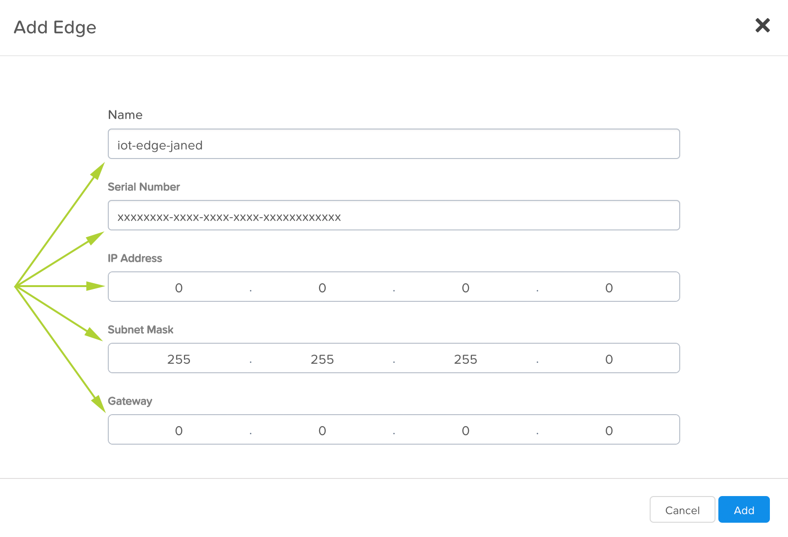

.. _edge:

------------
Edge Devices
------------

For the Nutanix Xi IoT lab to proceed, each lab attendee will configure a connection to a pre-staged edge device.

**Please refer to the IP address and serial number that has been provided to you.  Please use only your IP address and serial number!**

1. Login to the Nutanix Xi IoT Dashboard_ using the credentials that have been provided for you.
2a. Option 1: Using the "hamburger" button, expand the **Infrastructure** section and select **Edges**.

.. figure:: ../images/hamburger.png

2b. Option 2: From the **Dashboard** page, click **Add Edge** inside the **Getting Started** group.

3. Give your edge device a meaningful name, e.g. **iot-lab-<your_initials>**.  For Jane Doe, you could use **iot-lab-janed**.
4. Enter the provided edge device's serial number in the format **xxxxxxxx-xxxx-xxxx-xxxx-xxxxxxxxxxxx**
5. Enter the provided edge device's IP address.
6. Enter the lab network's subnet mask (**255.255.255.0**).
7. Enter the lab network's gateway (**0.0.0.0**).

For example (your settings will be different):

8. Click Add.

Adding the Nutanix Xi IoT edge device is now complete.

8. To verify the edge device has been added successfully and is available for use, wait until there is a green "check mark" next to the edge device's name in the **Getting Started** group, or check for the green online symbol next to the edge device's name in the edge list.

**Note**: After adding a new edge device, it will take some time before the device is online and usable.  After being added, the edge device will 

.. _Dashboard: https://iot.nutanix.com/

