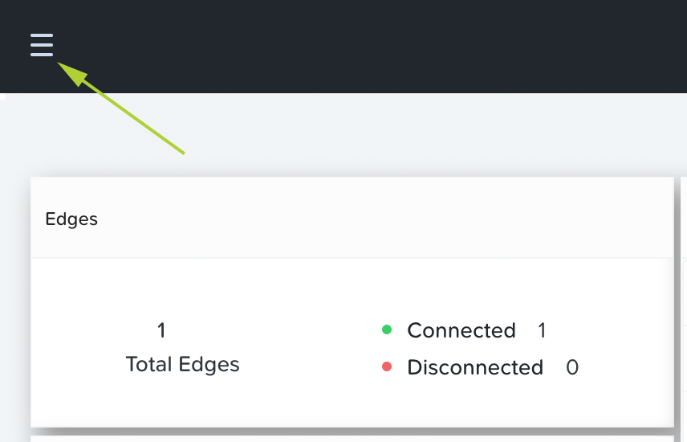
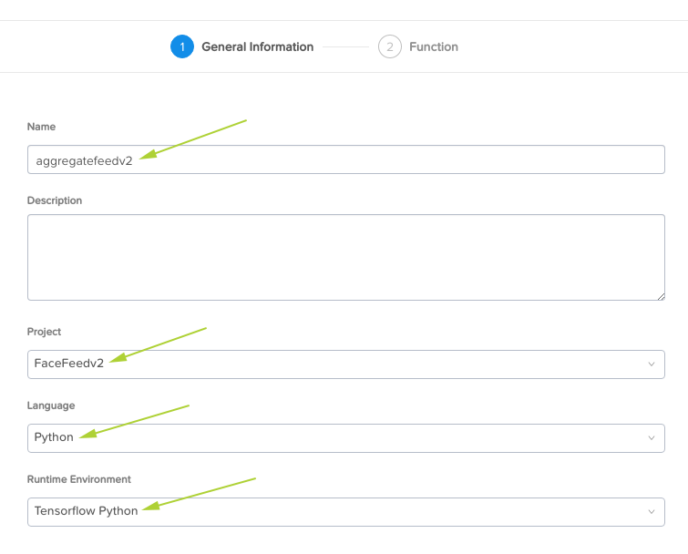
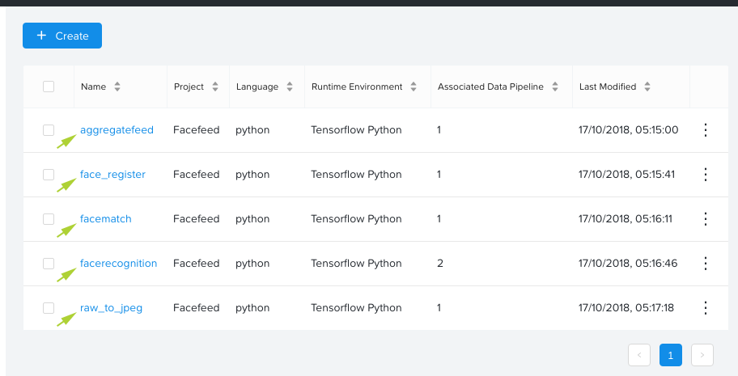

.. _functions:

*********
Functions
*********

The FaceFeed application utilises functions within Data Pipelines to transform the incoming data (video feed) and draw inference (Face IDs).

The functions described in this step are a critical part of the way FaceFeed works and specify the "order" in which the various processing steps happen.

1. Login to the Nutanix Xi IoT Dashboard_ using the credentials that have been provided for you.
2. Using the "hamburger" button, expand the **Apps and Data** section and select **Functions**.  Note that we are now using the **Apps and Data** section instead of the **Infrastructure** section used up to this point.

3. The functions we'll use have been created prior to this lab.  Before proceeding, please download the functions archive from the following link and extract it to your local computer: Functions_

For each of the Python functions contained in the archive, we will now create an individual function.  Repeats the following steps for each file.

4. Click **Create**.
5. Set the name of the function to the same name as the Python file, *maintaining case-sensititivity*.  For example, for the Python file **aggregatefeed.py**, set the function name to **aggregatefeed**.
6. Set the description to something meaningful.  Since these scripts are new to us, the description entered here doesn't really matter ...
7. Set the **Project** to the **FaceFeed** project we created earlier.
8. Set the **Language** to **Python**.
9. Set the **Runtime Environment** to **Tensorflow Python**.

10. Click **Next**.
11. Click **Choose File** and browse to the appropriate Python file downloaded earlier.
12. Click **Create**.
13. Repeat steps 4-12 for each of the other 4 Python functions.

When you have completed the steps above, you will have 5 functions created.

Adding the Nutanix Xi IoT Functions is now complete.

.. _Dashboard: https://iot.nutanix.com/
.. _Functions: http://bit.ly/facefeed-functions
