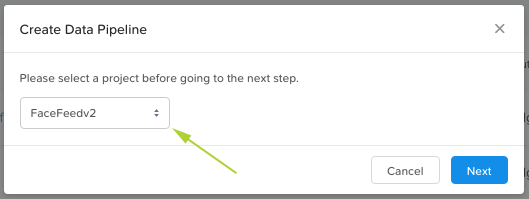
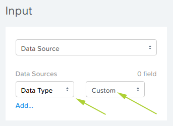
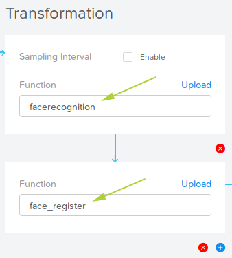
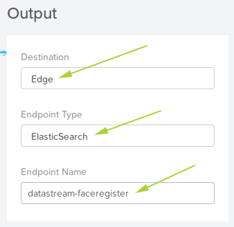
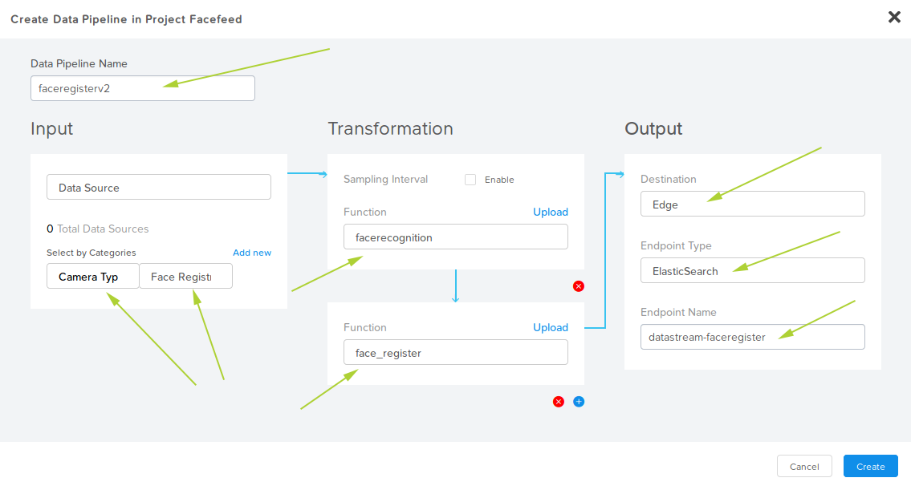
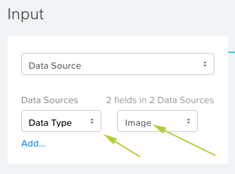
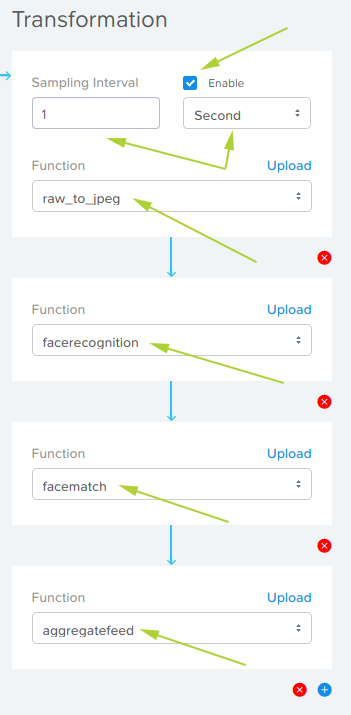
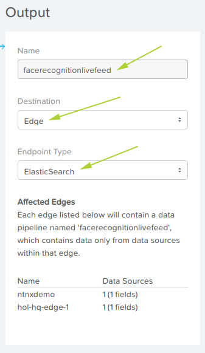

.. _pipelines:

*****************
Pipelines - Intro
*****************

.. raw:: html

  <strong>This step must be completed on your group's physical Edge Device only! Please do not complete this step on the virtual edge devices.</strong>

From the **Terminology** section:

A Data Pipeline is a path for data that includes input, processing, and output blocks. Enables you to process and transform captured data for further consumption or processing.

- Input - An existing data stream or data source, identified according to a Category
- Processing | Transformation - Code block such as a script to process or transform input data. Scripts are available in the Scripts library or can be uploaded to the library.
- Output - Publish data to the cloud or cloud data service (such as AWS Simple Queue Service) at the edge.

Pipelines - Creation
--------------------

FaceFeed uses two data pipelines.  In Nutanix Xi IoT data pipelines can be used to transform the data by injecting your own code.

For FaceFeed, we will transform pictures (video feed) into face IDs by using machine learning.

Pipeline #1 - "faceregister"
~~~~~~~~~~~~~~~~~~~~~~~~~~~~

Summary:

Data Pipeline 1: **faceregister**
This data pipeline will source the pictures from your laptop’s web-cam (after you deploy FaceFeed App container.), apply TensorFlow Machine Learning Model to detect faces, calculate unique FaceID and persist in local Elastic Search Instance running on your Edge device.

1. Login to the Nutanix Xi IoT Dashboard_ using the credentials that have been provided for you.
2. Using the "hamburger" button, expand the **Apps and Data** section and select **Data Pipelines**.

.. figure:: ../images/hamburger.png

3. Click **Create**.
4. From the dropdown list provided, select the **FaceFeed** application created earlier.

5. Click **Next**.
6. Within the **Input** section, click **Add Data Source** and select **Data Source**.
7. From the Data Sources dropdown list, select the **Data Type** category created earlier.
8. Set the field to **Custom**.

9. Within the **Transformation** section, click **Add Function**.
10. From the dropdown list, select **facerecognition**.  Remember that these function names match the Tensorflow Python functions created earlier.
11. Click **Add Function** again.
12. From the dropdown list, select **face_register**.

13. Within the **Output** section, click **Add Destination**.
14. From the dropdown list, select **Edge**.
15. Enter the Name as **faceregister** (exactly as shown, *including case-sensititivity*).
16. Set the Endpoint Type to **ElasticSearch**.

The final **faceregister** Data Pipeline, when created correctly, will look as shown in the screenshot below.

Pipeline #2 - "facerecognitionlivefeed"
~~~~~~~~~~~~~~~~~~~~~~~~~~~~~~~~~~~~~~~

Summary:

Data Pipeline 2: **facerecognitionlivefeed**
This data pipeline will source the pictures from RTSP camera data source we created earlier.
It will apply TensorFlow Machine Learning model to detect faces, calculate FaceIDs and lookup in the Elastic Search to find a match.
Application Container for Facefeed will show the Known vs Unknown faces depending upon inferencing.

1. Login to the Nutanix Xi IoT Dashboard_ using the credentials that have been provided for you.
2. Using the "hamburger" button, expand the **Apps and Data** section and select **Data Pipelines**.

.. figure:: ../images/hamburger.png

3. Click **Create**.
4. From the dropdown list provided, select the **FaceFeed** application created earlier.

5. Click **Next**.
6. Within the **Input** section, click **Add Data Source** and select **Data Source**.
7. From the Data Sources dropdown list, select the **Data Type** category created earlier.
8. Set the field to **Image**.

9. Within the **Transformation** section, click **Add Function**.
10. From the dropdown list, select **raw_to_jpeg**.
11. Check the Enable box next to **Sampling Interval**.
12. Set the Sampling Interval to **1 Second**.
13. Click **Add Function** again.
14. From the dropdown list, select **facerecognition**.
15. Click **Add Function** again.
16. From the dropdown list, select **facematch**.
17. Click **Add Function** again.
18. From the dropdown list, select **aggregatefeed**.

19. Within the **Output** section, click **Add Destination**.
20. From the dropdown list, select **Edge**.
21. Enter the Name as **facerecognitionlivefeed** (exactly as shown, *including case-sensititivity*).
22. Set the Endpoint Type to **ElasticSearch**.

Note: Your associated edge device list will be different.

The final **facerecognitionlivefeed** Data Pipeline, when created correctly, will look as shown in the screenshot below.

.. figure:: ../images/create_dp_faceregister_final_2.png

Adding the Nutanix Xi IoT Data Pipelines is now complete.

.. _Dashboard: https://iot.nutanix.com/
.. _Functions: http://bit.ly/facefeed-functions
