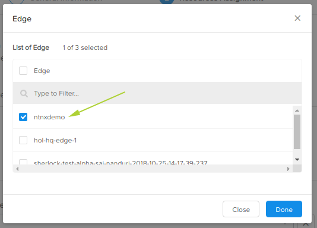

.. _project:

********
Projects
********

For our lab, the main Project is going to group together our edge, data source and project users, as well as data made up of applications, data streams, scripts and runtime environments.

Projects are created by Infrastructure Admins.

1. Login to the Nutanix Xi IoT Dashboard_ using the credentials that have been provided for you.
2a. Option 1: Using the "hamburger" button, select **Projects**.  Note how Projects are not part of Infrastructure like the previous objects we've created.

.. figure:: ../images/hamburger.png

2b. Option 2: From the **Dashboard** page, click **Create Project** inside the **Getting Started** group.

3. For the Project name, enter **FaceFeed**.  This is how we identify the project itself.    The screenshot below shows a different application name due to our demo environment already containing an application called **FaceFeed**.
4. Set Description to something meaningful e.g. **Application to capture and identify faces via RTSP camera feed**.
5. Click **Add Users**.
6. Select **your** username and click **Done**.

The following steps are where we select which objects will be part of this application. e.g. edge device etc.

7. Click **Next**.
8. Click **Add Edges** and place a checkmark next to the edge device you created earlier.
9. Click **Done**.

10. From the Cloud Profile Selection dropdown list, select the **ecr-facefeed-demo** Cloud Profile we created earlier.
11. From the Container Registry Selection, select the **ecr-facefeed-registry** Container Registry we created earlier.

12. Click **Create**.

Adding the Nutanix Xi IoT Project is now complete.

.. _Dashboard: https://iot.nutanix.com/
