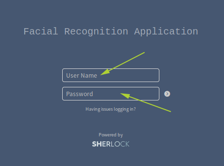
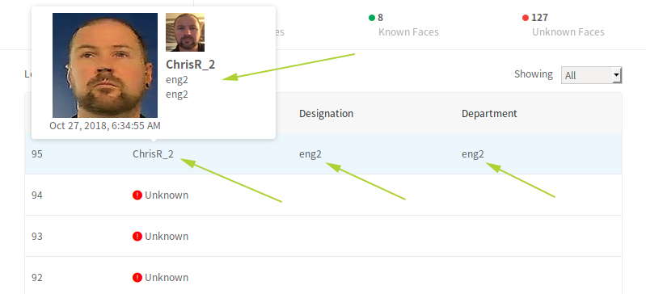

.. _verify:

***************
Verify FaceFeed
***************

We can now carry out a test to make sure the FaceFeed app is operating correctly.

1. On your local computer, browse to https://<edge_device_ip_address:8888>
2. Login to the FaceFeed application with the username **demo** and password **facefeed**.

3. Click **Camera** to capture your image with the laptop's local webcam or **Upload** to use an existing image.
4. Enter registration details and click **Add to Database**.

**Note:** If the **Add to Database** button spins and stops, but details are not added to the List of Registered Faces, it is possible that a face could not be detected from the supplied image. Try uploading again with a higher resolution image.

5. Click **Go to application**.  A log of known and unknown faces should appear.
6. As faces are captured on the physical edge's connected IP camera, this list will be modified to include the details faces that are registered vs **Unknown** for faces that are not registered.

Verifying the FaceFeed app's functionality is now complete.